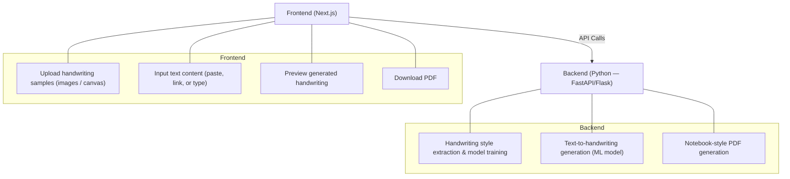
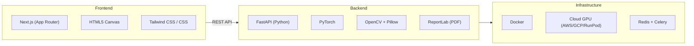

# Handwriting Synthesis Application — Research & Feasibility

## ✅ Can This Be Built? — Yes, Absolutely

### What We're Building

A **Handwriting Synthesis** application (not OCR — OCR is the *reverse*, reading handwriting). The app:

1. **Takes** handwriting samples from a user
2. **Learns/mimics** their handwriting style
3. **Generates** new text in that style on a notebook-like background
4. **Exports** it as a realistic PDF that looks like someone physically wrote in a notebook

---

## 🏗️ Architecture Overview

> [!IMPORTANT]
> Next.js handles the UI, but the **heavy ML work must run on a Python backend**. JavaScript/Node.js is not suitable for training or running handwriting synthesis models.

---

## 🧠 Core ML Approaches

### 1. RNN/LSTM Stroke-Based Generation (Classic)

- Based on Alex Graves' seminal paper on handwriting generation
- The model learns pen strokes (x, y, pen-up/pen-down) from your samples
- Generates new strokes character-by-character
- **Pros**: Lightweight, well-understood, produces vector output
- **Cons**: Needs significant samples per user, can be shaky
- **Libraries**: PyTorch, TensorFlow

### 2. GANs (Generative Adversarial Networks) (Modern)

- Models like **ScrabbleGAN**, **GANwriting**, or **HWT (Handwriting Transformers)**
- Learn to generate realistic handwriting images
- Can work with fewer samples (style transfer approach)
- **Pros**: Realistic output, works with fewer samples
- **Cons**: Harder to train, needs GPU

### 3. Diffusion Models (State-of-the-Art)

- Models like **WordStylist** or custom diffusion approaches
- Highest quality output
- Can learn style from just a few samples (few-shot learning)
- **Pros**: Best quality, few samples needed
- **Cons**: Slow inference, heavy compute

### 4. Practical/Hybrid Approach (Recommended to Start)

- Use a **pre-trained handwriting synthesis model** and fine-tune on user's samples
- Or extract font-like features from samples and use procedural generation with randomness
- **Tools**: `handwriting-synthesis` (Python lib), custom SVG generation
- **Pros**: Fastest to build, decent results
- **Cons**: Less "perfect" mimicry

---

## 📚 What You Need to Learn

### Must-Know (Core)

| Area | What to Learn | Why |
|------|--------------|-----|
| **Next.js** | App Router, API routes, file uploads | Frontend + lightweight API |
| **Python** | FastAPI or Flask | ML backend server |
| **Deep Learning Basics** | PyTorch (preferred), neural networks | Model training & inference |
| **Image Processing** | OpenCV, Pillow (PIL) | Processing handwriting samples |
| **PDF Generation** | `reportlab` or `fpdf2` (Python) | Creating notebook-style PDFs |

### Should-Know (For Quality)

| Area | What to Learn | Why |
|------|--------------|-----|
| **GANs or Diffusion Models** | Architecture, training loops | Better handwriting generation |
| **Transfer Learning** | Fine-tuning pre-trained models | Learn from few samples |
| **Canvas API** | HTML5 Canvas, drawing input | Let users write samples in-browser |
| **Computer Vision** | Segmentation, preprocessing | Extract characters from sample images |
| **Cloud GPU** | AWS/GCP/RunPod | Training models needs GPU |

### Nice-to-Know (Polish)

| Area | What to Learn | Why |
|------|--------------|-----|
| **Docker** | Containerization | Deploy ML backend |
| **WebSockets** | Real-time updates | Show generation progress |
| **Celery/Redis** | Task queues | Handle long-running ML tasks |

---

## 🔧 Existing Tools & Papers to Study

| Resource | Type | Description |
|----------|------|-------------|
| **Graves Handwriting RNN** | Paper + Code | Alex Graves, 2013 — many GitHub implementations |
| **handwriting-synthesis** | Python Library | `pip install handwriting-synthesis` |
| **ScrabbleGAN** | GAN Paper | Few-shot handwriting generation |
| **GANwriting** | GAN Paper | Style-conditioned handwriting |
| **HWT** | Transformer | Handwriting Transformers |
| **calligrapher.ai** | Live Demo | See what's possible with RNN approach |
| **text-to-handwriting** | JS Tool | Simple font-based approach (starting point) |
| **IAM Handwriting Dataset** | Dataset | Public dataset for training handwriting models |

---

## 🚀 Suggested Roadmap

### Phase 1: MVP (2–4 weeks)

- [ ] Simple approach: Extract handwriting "font" from samples
- [ ] Use procedural generation with randomness (letter spacing, slant, size variation)
- [ ] Generate text on notebook-lined background
- [ ] Export as PDF

### Phase 2: ML-Powered (4–8 weeks)

- [ ] Implement RNN-based handwriting synthesis
- [ ] Train on IAM Handwriting Dataset (public dataset)
- [ ] Add user fine-tuning from uploaded samples
- [ ] Improve realism

### Phase 3: Production Quality (8–12 weeks)

- [ ] Switch to GAN/Diffusion model for better quality
- [ ] Few-shot learning (5–10 sample images enough)
- [ ] Natural imperfections (ink variation, pressure, slight mistakes)
- [ ] Multiple notebook styles, pen types

---

## ⚠️ Key Challenges

> [!WARNING]
> **"Exactly same, no mistakes"** — This is the hardest part. Perfect mimicry requires lots of training data or a very good few-shot model. Expect 80–90% similarity initially.

> [!CAUTION]
> **Legal/Ethical Concerns** — Handwriting forgery has legal implications. Consider adding watermarks or limiting use cases.

| Challenge | Details |
|-----------|---------|
| **Compute costs** | Training/fine-tuning per user needs GPU. Consider cloud GPU pricing. |
| **Speed** | Generating a full page of handwriting can take 10–60 seconds depending on approach. |
| **Sample quality** | Users need to provide clear, consistent handwriting samples for good results. |
| **Multi-language support** | Each language/script needs different handling and training data. |

---

## 💡 Recommended Starting Strategy

1. **Start with the simple approach first**: Use a library like Python's `handwriting-synthesis` or build a custom SVG-based generator that maps character shapes from samples with natural randomness
2. **Build the full Next.js + Python pipeline** end-to-end with the simple approach
3. **Then upgrade the ML model** once the pipeline works

---

## 🛠️ Tech Stack Summary

---

*Document created: June 7, 2026*
